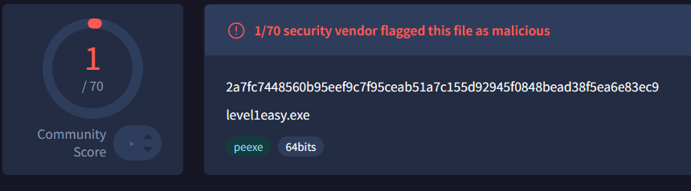
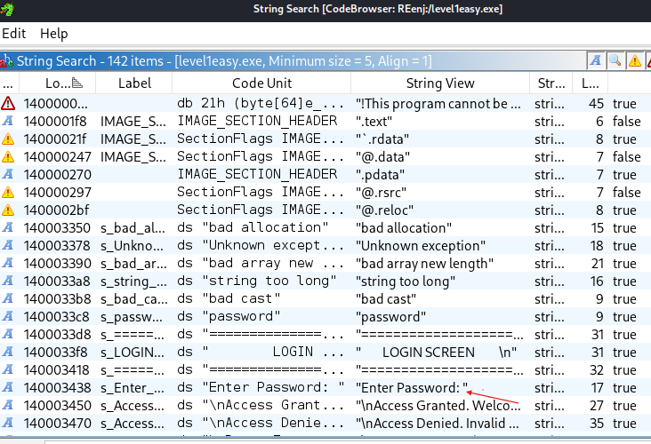
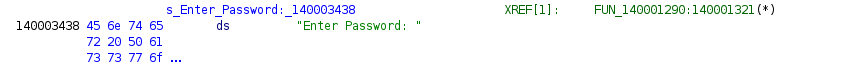
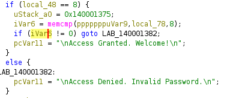
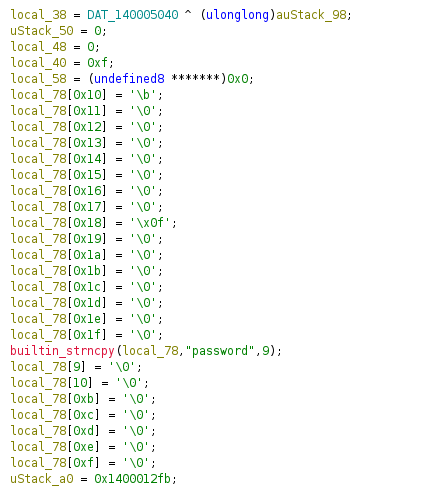
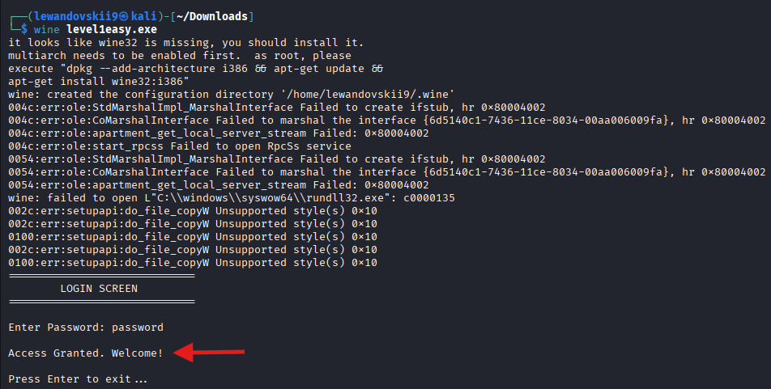

# Crackmes.one - 1st write-up 

* **Source Material:** crackmes.one 
* **URL:** https://crackmes.one/crackme/6a512980234391ae74f63ae8 
* **File Name:** `level1easy.exe` 
* **MD5:** `ee43bb935bdcd442363ca5f0d2372137`
* **SHA256:** `2a7fc7448560b95eef9c7f95ceab51a7c155d92945f0848bead38f5ea6e83ec9`
* **Architecture:** x86-64 | **Language:** C/C++
* **Platform:**  Windows
---

### Executive Summary:

Reverse-engineered a Windows binary using Ghidra without executing the file. Located the password validation function and recovered credential through static analysis. Practical execution via Wine confirmed the finding. Demonstrates ability to trace program logic in disassembled code without source access.

---
### Technical Triage

**Community score** : 1/70 security vendor flag this PE as malicious.
**Protections:** None (No Packers / No Anti-Debugging)

---
### Decompilation & Static Analysis

1) Program main code.

Found password identificator via `Ghidra Search` using `Search For String` option.The string `Enter Password:` referenced at `140003438` led directly to the core validation block via `XREF[1]`.

Located the primary target function (`FUN_140001290`).

2) Password Logic & Variables

The function first validates that user input length equals 8 characters (`local_48 == 8`). The reference password is hardcoded directly in the binary via `strncpy(local_78, "password", 9)`. The program then uses `memcmp` to compare the first 8 bytes of user input against this hardcoded buffer. If the comparison returns 0 (exact match), access is granted. Otherwise, the program prints "Access Denied."

From this screenshot, we can see red texted `strncpy` copy work.

- **Short Note :** `strncpy` copy password with 0 byte in end because of peculiarity `C-like` languages, `memcmp` stops when 0 byte in the end. But if object that been compared doesnt have it, its led to `Buffer Overflow` which breaks program.

3) Result
I used `wine` to test analysis results of `Ghidra` (Because PE was built for Windows platform), and it ended successfully.

---

### IoCs:

| Type               | Value                                                              |
| ------------------ | ------------------------------------------------------------------ |
| File Name          | `level1easy.exe`                                                   |
| MD5                | `ee43bb935bdcd442363ca5f0d2372137`                                 |
| SHA256             | `2a7fc7448560b95eef9c7f95ceab51a7c155d92945f0848bead38f5ea6e83ec9` |
| Recovered Password | `password`                                                         |
