# Crackmes.one - 2nd write-up 

### Scenario

* **Source Material:** crackmes.one 
* **URL:** https://crackmes.one/crackme/694c3de30c16072f40f5a3d2
* **File Name:**  crackme.exe
* **MD5:** 7ef617ad15c8f344a244be9a6ee0bd1a
* **SHA256:** 3993f0b63a4cc41b20457fd3866a923a45a5d46522cc61daa11a129945c5c546
* **Architecture:** x86-64 | **Language:** C/C++
- **Platform:** Windows

---
### Executive Summary:

Performed static binary analysis on a PE from crackmes, identifying an anti-debugging(dual-check via IsDebuggerPresent and CheckRemoteDebuggerPresent) and string obfuscation program (XOR-decrypted (0x5A) immediately before printing and re-encrypted immediately after , to defeat both static string extraction and memory-dump analysis). Reconstructed the algorithm in a Python keygen and validated it via Wine, recovering the correct key (636460696C) for username admin and the flag `Congrats{U_Solv3d_1t!}`. Demonstrates algorithm reverse-engineering.  

---
### Technical Triage
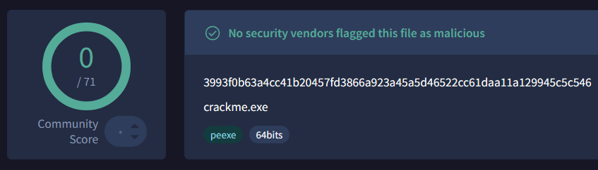

- **0/71 vendors** flagged this file as malicious.
- **Protections:** Anti-debugging, string obfuscation.

---
### Decompilation & Static Analysis

To understand program logic and how it works, for analysis it must be considered 2 main functions.
(`FUN_140020a20` and `FUN_140001780`).

First main function I located with `Search to String` feature. With filter on `fail`.

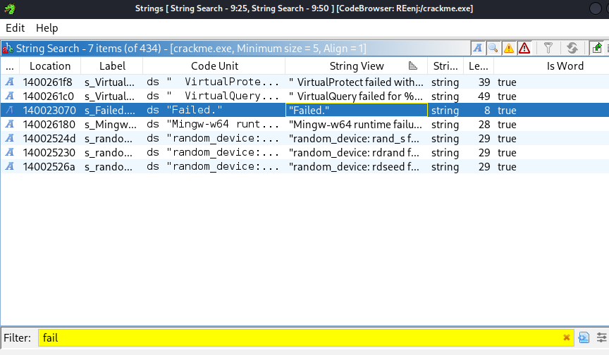

This led to the `FUN_140020a20` function (at 140020a20), which references the `Failed` string at 140023070. With deeper investigation on `FUN_140020a20`, analysis shows it is main PE logic.
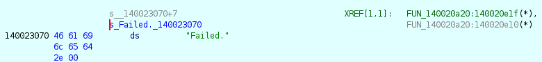

#### Program logic:

1. Workflow - The initial phase begins in the main function (`FUN_140020a20`), where the binary executes an anti-debugging function (`FUN_140001740`) and terminates if a debugger is detected.

Code 1:
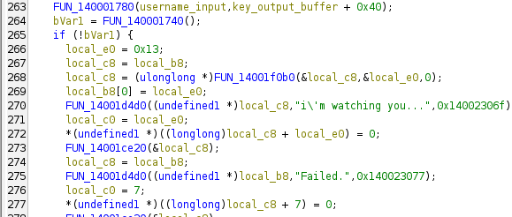

`FUN_140001740`:
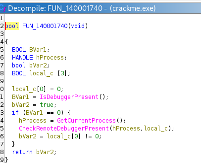

2. Workflow - Once past the check, the program verifies that the `Username` is under 9 characters and passes it to `FUN_140001780` to derive the valid key. Inside `FUN_140001780`, the algorithm applies a bitwise `XOR 0x0D` operation to each character, reverses the byte array, and formats the output into an uppercase hex string via `"0123456789ABCDEF"`.

Code 2:
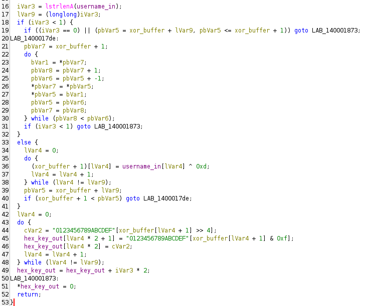

3. Workflow  of code 3 - Both the success and failure messages (`success_msg_enc`, `fail_msg_enc`) are stored as XOR-encrypted. Before each string is printed via `puts()`, a loop XORs it with the constant `0x5A` to decrypt it. Immediately after printing, the same XOR loop runs again. Since XOR is self-inverting (working twice returns the original value) it handles both tasks decryption and re-encryption .
   Finally, the application uses `lstrcmpA` to compare the user's input against the computed hash, displaying the success flag upon a match.

Code 3:
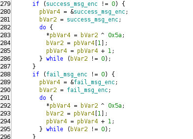

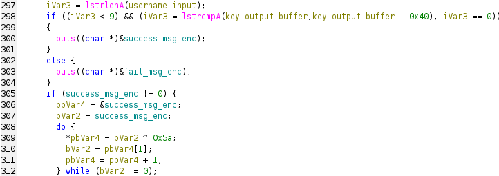

- **Short Note -** Its very helpful to filter on keywords such as `fail`,`success`, `password`, etc. 

#### Result

Keygen based on username:
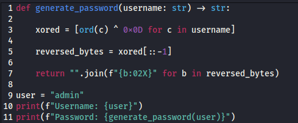

Keygen result:
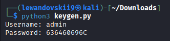

Keygen based on extracted logic from function `FUN_140001780` correctly validated. This confirms the recovered flag: `Congrats{U_Solv3d_1t!}`.

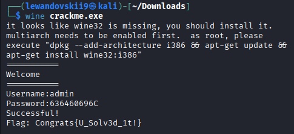

---

### IoCs:

| Type               | Value                                                            |
| ------------------ | ---------------------------------------------------------------- |
| File name          | crackme.exe                                                      |
| MD5                | 7ef617ad15c8f344a244be9a6ee0bd1a                                 |
| SHA256             | 3993f0b63a4cc41b20457fd3866a923a45a5d46522cc61daa11a129945c5c546 |
| Recovered Password | 636460696C (for username `admin`)                                |
| Flag               | `Congrats{U_Solv3d_1t!}`                                         |
