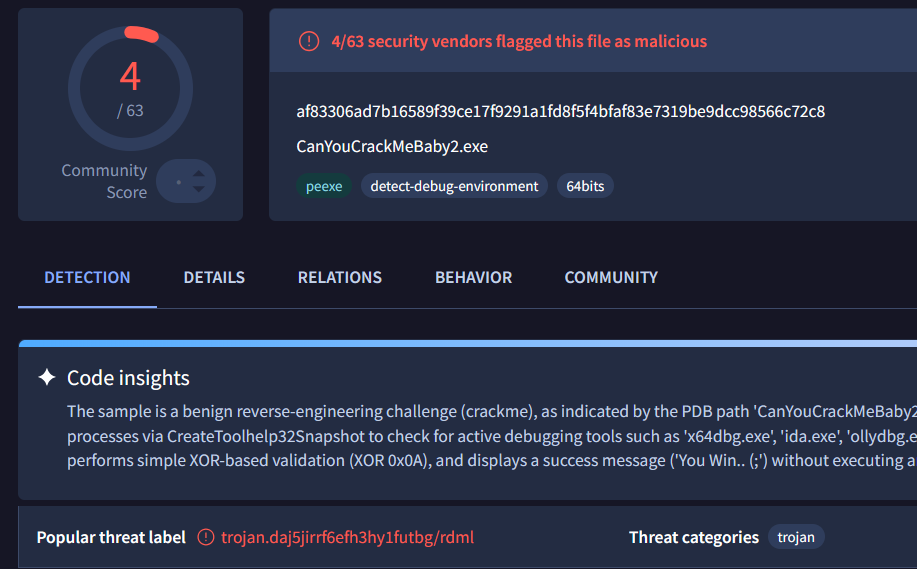
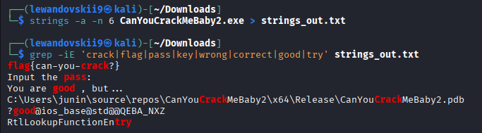
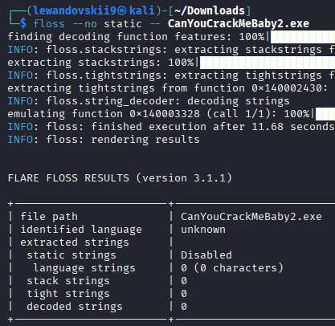

# Analysing PE with `string` and `FLOSS`

	Goal - See how `string` and `FLOSS` tools work on practice materials and distinguish between static and obfuscated string extraction without executing the binary.

* **Source Material:** crackmes.one 
* **URL:** `https://crackmes[.]one/crackme/6a0bd0592b3df128c1df5c16` 
* **File Name:** `CanYouCrackMeBaby2.exe`
* **MD5:** `59bc995af602d1dda74fa17074d64521` 
* **SHA256:** `af83306ad7b16589f39ce17f9291a1fd8f5f4bfaf83e7319be9dcc98566c72c8`

---

```
Executive Summary:

Performed static analysis on `CanYouCrackMeBaby2.exe` from crackmes.one, to compare `strings` and `FLOSS` extraction tools.
VirusTotal triage confirmed the file is a CrackMe challenge (4/63 detection rate).
Using standard `strings`, the plain-text secret (`flag{can-you-crack?}`) and developer PDB path were extracted without running the binary.
Second analysis with `FLOSS` verified that the executable program uses no string obfuscation or encryption.
```

---

#### Threat Intelligence

* **Community Score:** 4/63 (Low detection rate, classified as benign reverse-engineering challenge/crackme). 
* **Key Behavioral Tags:** `detect-debug-environment`, `peexe`, `64bits`. 
* **Anti-Analysis Note:** The binary checks for active debugging processes (`x64dbg.exe`, `ida.exe`, `ollydbg.exe`).

Result:


---
#### Analysis -

##### 1. strings analysis

Commands:
	1 - `strings -a -n 6 CanYouCrackMeBaby2.exe > strings_out.txt`
	
	2 - `grep -iE 'crack|flag|pass|key|wrong|correct|good|try' strings_out.txt`

*Workflow - Scans the entire PE file and filters output for suspicious strings*

Result:


##### 2. FLOSS analysis

Command:
	1 - `floss --no static -- CanYouCrackMeBaby2.exe`

*Workflow - Checks for stack-built, decoded, or obfuscated strings in binary memory.*



---
#### IoCs:

| Type               | Value                                                            |
| ------------------ | ---------------------------------------------------------------- |
| sha256             | af83306ad7b16589f39ce17f9291a1fd8f5f4bfaf83e7319be9dcc98566c72c8 |
| MD5                | 59bc995af602d1dda74fa17074d64521                                 |
| FileName           | CanYouCrackMeBaby2.exe                                           |
| Flag               | flag{can-you-crack?}                                             |
| Compilation Target | PE32+ executable (console) x86-64, for MS Windows                |

---
#### Detection Notes

- `strings` and `FLOSS` serve similar triage functions, but `FLOSS` provides advanced extraction for stack-based and obfuscated strings.

- `strings` is lightweight, faster, and built into most Linux distributions by default.

- `FLOSS` is a specialized malware analysis tool that requires standalone installation.

- The most efficient workflow is to use them together: start with `strings` for fast initial triage, and then followed by `FLOSS` to verify whether obfuscated strings wasnt missed.

- `FLOSS` can automatically identify and analyze obfuscated code (hard to human read, but can executed natively by any machines).
